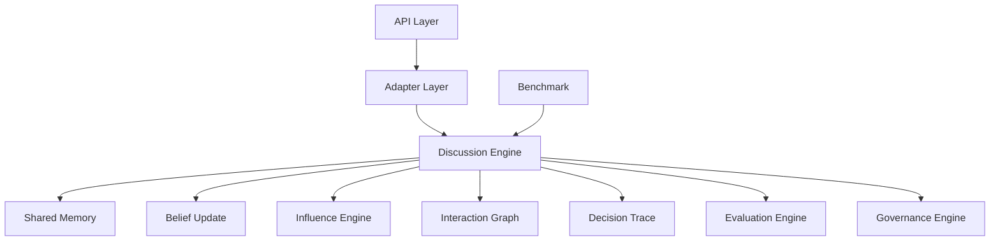
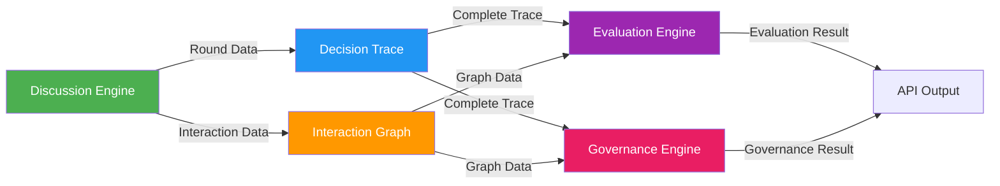

# Architecture Improvement Proposal

> 版本: 1.0  
> 更新时间: 2026-07-01  
> 状态: 待确认

---

## 一、当前架构评估

### 1.1 架构概览



### 1.2 当前架构问题

| 问题类别 | 具体问题 | 严重程度 |
|----------|----------|----------|
| 数据流动 | Discussion 数据未充分流向 Evaluation/Governance | 高 |
| 模块耦合 | Discussion Engine 直接依赖具体策略实现 | 中 |
| 接口设计 | 缺少统一的数据流接口 | 高 |
| 扩展性 | 策略替换需要修改多处代码 | 中 |
| 可观测性 | 缺少完整的决策过程追踪 | 高 |

---

## 二、架构改进目标

### 2.1 核心原则

1. **Research First** - 所有设计必须服务于科研需求
2. **Interface First** - 先定义接口，再实现
3. **Plugin Architecture** - 所有算法必须可替换
4. **Data-Driven** - Decision Trace 是核心数据资产
5. **Observable** - 完整的决策过程可追溯

### 2.2 改进方向

| 方向 | 说明 |
|------|------|
| 数据层统一 | 建立统一的讨论数据模型 |
| 策略层抽象 | 完善策略接口，实现真正的插件化 |
| 数据流优化 | 确保 Discussion → Trace → Evaluation/Governance 的完整数据流动 |
| 可观测性增强 | 建立完整的决策过程追踪机制 |
| 集成点标准化 | 定义标准的模块间集成接口 |

---

## 三、改进方案

### 3.1 统一数据模型

#### 3.1.1 讨论数据模型

```typescript
export interface DiscussionData {
  task: DiscussionTask;
  config: DiscussionConfig;
  
  agents: AgentInfo[];
  
  rounds: RoundData[];
  
  interactionGraph: InteractionGraph;
  
  decisionTrace: DecisionTrace;
  
  finalDecision: FinalDecision;
  
  metadata: {
    startTime: string;
    endTime: string;
    totalRounds: number;
    converged: boolean;
  };
}

export interface RoundData {
  roundNumber: number;
  timestamp: string;
  
  opinions: AgentOpinion[];
  
  beliefChanges: Record<string, { old: number; new: number; reason: string }>;
  
  influenceEvents: InfluenceEvent[];
  
  governanceIssues: GovernanceIssue[];
  interventions: Intervention[];
  
  converged: boolean;
}

export interface InfluenceEvent {
  sourceAgentId: string;
  targetAgentId: string;
  type: InfluenceType;
  weight: number;
  round: number;
  timestamp: string;
}
```

### 3.2 策略层抽象完善

#### 3.2.1 策略注册机制

```typescript
export class StrategyRegistry<T extends DiscussionStrategy> {
  private strategies: Map<string, T> = new Map();
  
  register(strategy: T): void {
    this.strategies.set(strategy.name, strategy);
  }
  
  get(name: string): T {
    const strategy = this.strategies.get(name);
    if (!strategy) {
      throw new Error(`Strategy ${name} not found`);
    }
    return strategy;
  }
  
  list(): string[] {
    return Array.from(this.strategies.keys());
  }
  
  has(name: string): boolean {
    return this.strategies.has(name);
  }
}
```

#### 3.2.2 策略接口标准化

```typescript
export interface StrategyFactory<T extends DiscussionStrategy> {
  create(config?: Record<string, unknown>): T;
}

export interface StrategyConfig {
  strategyName: string;
  params?: Record<string, unknown>;
}
```

### 3.3 数据流优化

#### 3.3.1 数据流向图



#### 3.3.2 数据传递接口

```typescript
export interface DataProvider {
  getDiscussionData(): DiscussionData;
  
  getDecisionTrace(): DecisionTrace;
  
  getInteractionGraph(): InteractionGraph;
  
  getAgentStates(): AgentState[];
  
  getRoundResults(): RoundResult[];
}
```

### 3.4 可观测性增强

#### 3.4.1 事件追踪系统

```typescript
export type DiscussionEventType = 
  | "round_start" 
  | "round_end" 
  | "agent_message" 
  | "belief_update" 
  | "influence_event"
  | "governance_issue"
  | "intervention"
  | "convergence"
  | "decision";

export interface DiscussionEvent {
  type: DiscussionEventType;
  timestamp: string;
  roundNumber: number;
  payload: Record<string, unknown>;
}

export interface EventTracker {
  track(event: DiscussionEvent): void;
  
  getEvents(type?: DiscussionEventType): DiscussionEvent[];
  
  getEventsByRound(roundNumber: number): DiscussionEvent[];
  
  subscribe(callback: (event: DiscussionEvent) => void): () => void;
}
```

### 3.5 集成点标准化

#### 3.5.1 模块间接口

```typescript
export interface EvaluationInput {
  decisionTrace: DecisionTrace;
  interactionGraph: InteractionGraph;
  agentDecisions: AgentDecision[];
  agents: AgentInfo[];
  finalDecision: string;
  groundTruth?: GroundTruth;
}

export interface GovernanceInput {
  decisionTrace: DecisionTrace;
  interactionGraph: InteractionGraph;
  agentBeliefs: AgentBelief[];
  messages: MessageInfo[];
  agentIds: string[];
}
```

---

## 四、架构改进前后对比

### 4.1 数据流动对比

| 特性 | 当前状态 | 改进后 |
|------|----------|--------|
| Discussion → Trace | 部分 | 完整 |
| Trace → Evaluation | 简化 | 完整 |
| Trace → Governance | 简化 | 完整 |
| Graph → Evaluation | 无 | 完整 |
| Graph → Governance | 无 | 完整 |

### 4.2 策略扩展性对比

| 特性 | 当前状态 | 改进后 |
|------|----------|--------|
| 策略注册 | 硬编码 | 动态注册 |
| 策略配置 | 固定 | 可配置 |
| 策略替换 | 修改代码 | 插件替换 |
| 多策略支持 | 单策略 | 多策略并存 |

### 4.3 可观测性对比

| 特性 | 当前状态 | 改进后 |
|------|----------|--------|
| 事件追踪 | 无 | 完整事件系统 |
| 实时监控 | 无 | 订阅机制 |
| 过程回放 | 有限 | 完整回放 |
| 数据导出 | 有限 | 完整导出 |

---

## 五、实施计划

### 5.1 阶段一：数据模型统一

| 步骤 | 任务 | 代码位置 |
|------|------|----------|
| 1 | 更新 `types.ts` 添加统一数据模型 | `src/lib/discussion/types.ts` |
| 2 | 更新 `DiscussionResult` 类型 | `src/lib/discussion/types.ts` |
| 3 | 更新 `DiscussionEngine` 返回统一数据 | `src/lib/discussion/index.ts` |

### 5.2 阶段二：策略层完善

| 步骤 | 任务 | 代码位置 |
|------|------|----------|
| 1 | 实现 `StrategyRegistry` | `src/lib/discussion/strategyRegistry.ts` |
| 2 | 更新所有策略使用注册机制 | `src/lib/discussion/` |
| 3 | 添加策略工厂接口 | `src/lib/discussion/types.ts` |

### 5.3 阶段三：数据流优化

| 步骤 | 任务 | 代码位置 |
|------|------|----------|
| 1 | 更新 Evaluation Engine 接口 | `src/lib/evaluation/types.ts` |
| 2 | 更新 Governance Engine 接口 | `src/lib/governance/types.ts` |
| 3 | 更新 API 传递完整数据 | `src/app/api/v3/` |

### 5.4 阶段四：可观测性增强

| 步骤 | 任务 | 代码位置 |
|------|------|----------|
| 1 | 实现 `EventTracker` | `src/lib/discussion/eventTracker.ts` |
| 2 | 更新 `DiscussionEngine` 添加事件追踪 | `src/lib/discussion/index.ts` |
| 3 | 添加实时订阅机制 | `src/lib/discussion/eventTracker.ts` |

---

## 六、优先级与风险

### 6.1 优先级评估

| 优先级 | 改进项 | 研究价值 | 工程成本 |
|--------|--------|----------|----------|
| P0 | 数据模型统一 | 高 | 中 |
| P0 | 数据流优化 | 高 | 中 |
| P1 | 策略层完善 | 高 | 中 |
| P1 | 可观测性增强 | 中 | 低 |
| P2 | 实时监控 | 中 | 高 |

### 6.2 风险评估

| 风险 | 严重程度 | 缓解措施 |
|------|----------|----------|
| 类型变更影响 | 高 | 保持向后兼容 |
| 数据量增加 | 中 | 提供精简模式 |
| 性能影响 | 低 | 优化数据结构 |

---

## 七、预期收益

### 7.1 架构完善度提升

| 维度 | 当前评分 | 改进后 |
|------|----------|--------|
| 数据完整性 | 50% | 90%+ |
| 策略扩展性 | 60% | 90%+ |
| 可观测性 | 30% | 80%+ |
| 模块耦合度 | 中 | 低 |

### 7.2 科研价值提升

| 能力 | 当前状态 | 改进后 |
|------|----------|--------|
| 实验可复现性 | 低 | 高 |
| 对比分析能力 | 有限 | 强 |
| 算法替换能力 | 弱 | 强 |
| 过程追溯能力 | 有限 | 完整 |

---

## 八、结论

当前架构虽然具备了基本的模块划分，但在数据流动、策略抽象和可观测性方面存在严重不足，限制了科研能力的发挥。

改进方案通过：
1. **统一数据模型** - 建立完整的讨论数据表示
2. **策略层完善** - 实现真正的插件化架构
3. **数据流优化** - 确保完整的数据流向
4. **可观测性增强** - 建立完整的事件追踪系统

将 SwarmAlpha 从「Web 应用架构」升级为「科研平台架构」，使其能够真正支撑未来的论文研究、实验室合作和 Benchmark 测试。

**建议优先实施阶段一和阶段三，确保数据完整性是所有改进的基础。**
