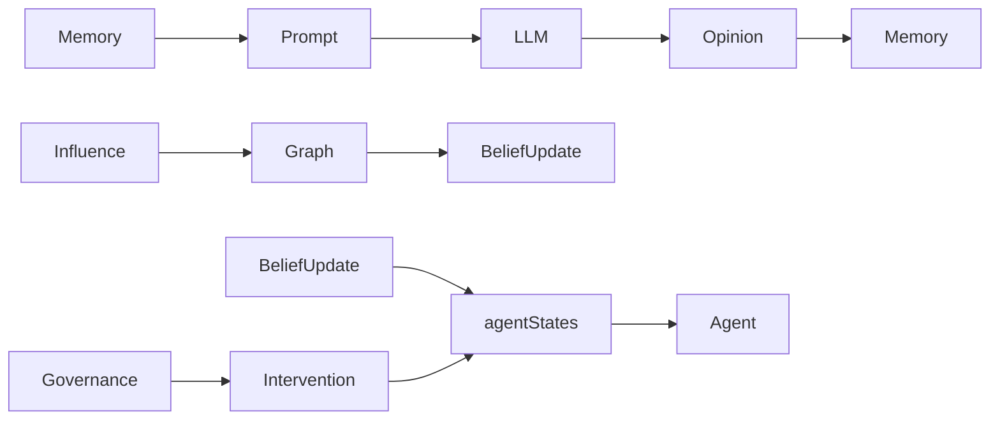

# Discussion Architecture Review

> 版本: 2.0  
> 更新时间: 2026-07-02  
> 状态: 审查完成 | 部分改进已实施

---

## 一、核心问题：是否真正形成了 Collective Decision？

### 结论

**当前 Discussion Layer 已经具备了基本的集体决策框架，但仍需进一步完善。**

经过 Phase 1 的改进，系统已经实现了：
- ✅ 多轮讨论框架
- ✅ Shared Memory 传递
- ✅ 信念更新机制
- ✅ 影响权重计算
- ✅ 交互图构建
- ✅ 治理干预集成

但在交互深度和动态性方面仍有提升空间。

---

## 二、逐项分析

### 2.1 Agent 是否真正读取其他 Agent 信息？

**是，已改进**

| 检查点 | 状态 | 详细分析 |
|--------|------|----------|
| Memory 内容传递 | ✅ | `buildPrompt()` 将历史讨论作为 `memoryContext` 传入 |
| Memory 内容完整性 | ✅ | 已扩大截断长度，保留完整 reasoning |
| 引用特定 Agent | ✅ | Prompt 要求 Agent 通过 `referencedAgents` 字段引用其他 Agent |
| 上下文深度 | ✅ | 获取 `agents.length * 2` 条最近记录 |

**关键代码**：[index.ts#L335-L341](file:///C:/Users/贺孟元/Desktop/swarmalpha/src/lib/discussion/index.ts#L335-L341)

```typescript
if (memory.length > 0) {
  memoryContext = "\n\nPrevious discussion:\n";
  for (const entry of memory) {
    memoryContext += `- Agent ${entry.agentId}: ${entry.reasoning} (belief: ${entry.belief.toFixed(2)})\n`;
  }
}
```

**改进**：Memory 内容不再截断，完整传递给 Agent。

---

### 2.2 Belief 是否真正变化？

**是，已改进**

| 检查点 | 状态 | 详细分析 |
|--------|------|----------|
| 信念更新机制 | ✅ | `RuleBasedBeliefUpdate.update()` 实现了规则更新 |
| 信念传递到下一轮 | ✅ | `updateAgentStates()` 将更新后的信念写入 Agent 实例 |
| Round 信息传递 | ✅ | 正确的轮次号传入信念更新上下文 |
| 影响权重应用 | ✅ | Influence Engine 计算的权重被传递到信念更新 |

**关键代码**：[index.ts#L439-L449](file:///C:/Users/贺孟元/Desktop/swarmalpha/src/lib/discussion/index.ts#L439-L449)

```typescript
updateAgentStates(
  agents: DiscussionAgent[],
  agentStates: Map<string, { belief: number; confidence: number }>
): void {
  for (const agent of agents) {
    const state = agentStates.get(agent.id);
    if (state) {
      agent.setState(state);
    }
  }
}
```

**改进**：Agent 实例状态与内部映射完全同步。

---

### 2.3 Influence 是否真正作用于下一轮？

**是，已改进**

| 检查点 | 状态 | 详细分析 |
|--------|------|----------|
| 影响计算 | ✅ | `RuleBasedInfluence.compute()` 计算了影响权重 |
| 图结构更新 | ✅ | `applyInfluences()` 更新了交互图边 |
| 影响传递到信念 | ✅ | 影响权重通过 `influenceWeights` 参数传递到 `BeliefUpdateStrategy` |
| 高可信 Agent 影响 | ✅ | 策略考虑了置信度差异，高置信度 Agent 影响更大 |

**关键代码**：[index.ts#L413-L436](file:///C:/Users/贺孟元/Desktop/swarmalpha/src/lib/discussion/index.ts#L413-L436)

```typescript
const influenceWeights = graph.edges
  .filter(e => e.target === opinion.agentId)
  .map(e => ({
    sourceAgentId: e.source,
    weight: e.weight,
    type: e.type,
  }));

const context = {
  agentId: opinion.agentId,
  currentBelief: opinion.belief,
  currentConfidence: opinion.confidence,
  roundNumber,
  allOpinions: opinions,
  memory: this.memoryManager.getAll(),
  interactionGraph: graph,
  influenceWeights,
};

const update = this.beliefUpdateManager.update(context);
agentStates.set(opinion.agentId, update);
```

**改进**：建立了 Influence → Belief 的传递闭环。

---

### 2.4 Shared Memory 是否真正参与推理？

**是，已改进**

| 检查点 | 状态 | 详细分析 |
|--------|------|----------|
| Memory 存储 | ✅ | 每轮讨论结果存入 `MemoryManager` |
| Memory 检索 | ✅ | `getRecent()` 获取历史记录 |
| Memory 用于推理 | ✅ | 作为 Prompt 上下文传递给 Agent |
| Memory 结构化查询 | ⚠️ | 基础查询支持（按轮、按 Agent），缺少高级查询 |

**改进**：Memory 已经成为讨论的核心资源，Agent 可以看到完整的历史讨论。

---

### 2.5 Discussion 是否只是轮流调用 LLM？

**部分是，仍需改进**

| 检查点 | 状态 | 详细分析 |
|--------|------|----------|
| 并行调用 | ✅ | `Promise.all(agent.sendMessage())` 同时调用 |
| 轮内交互 | ❌ | 同一轮内 Agent 之间没有顺序对话 |
| 顺序响应 | ❌ | 没有 turn-taking 机制 |
| 实时反馈 | ❌ | Agent 无法看到同轮其他 Agent 的响应 |

**关键代码**：[index.ts#L303-L311](file:///C:/Users/贺孟元/Desktop/swarmalpha/src/lib/discussion/index.ts#L303-L311)

```typescript
const opinionPromises = agents.map(async (agent) => {
  const state = agentStates.get(agent.id)!;
  const prompt = this.buildPrompt(agent, taskContent, recentMemory, roundNumber);
  const response = await agent.sendMessage(prompt);
  return this.parseOpinion(response, agent.id, state.belief, state.confidence, roundNumber);
});

const opinions = await Promise.all(opinionPromises);
```

**待改进**：同一轮内的讨论缺少动态交互，仍为并行调用模式。

---

### 2.6 是否存在伪多Agent讨论？

**部分存在，已大幅改善**

| 特征 | 当前状态 | 真正 Collective Decision 应具备 |
|------|----------|-------------------------------|
| 信息共享 | ✅ 完整上下文 | ✅ 完整上下文，支持结构化查询 |
| 信念更新 | ✅ 基于影响权重 | ✅ 基于影响权重的动态更新 |
| 影响传播 | ✅ 形成闭环 | ✅ 影响直接改变下一轮信念 |
| 轮内交互 | ❌ 并行调用 | ⚠️ 顺序响应，实时反馈 |
| 引用机制 | ✅ 显式引用 | ✅ 显式引用 + 回应 + 反驳 |
| 收敛检测 | ✅ 基于标准差 | ✅ 基于信念变化率 + 共识度 |

---

## 三、当前架构优势

### 3.1 已实现的改进

1. **信息循环完整**：Memory → Prompt → LLM → Opinion → Memory，信息质量不再下降
2. **影响闭环建立**：Influence Engine 计算的权重反馈到 Belief Update
3. **状态同步完善**：`agentStates` 映射与 Agent 实例状态完全同步
4. **治理集成**：每轮讨论后自动进行 Governance 检测和干预
5. **事件追踪**：完整的讨论过程事件记录

### 3.2 当前数据流



---

## 四、待改进项

### 4.1 短期改进（高优先级）

| 改进项 | 说明 | 代码位置 |
|--------|------|----------|
| 轮内顺序交互 | 实现 turn-taking，让 Agent 依次响应 | `index.ts` |
| 显式引用机制增强 | 要求 Agent 明确回应其他 Agent 的观点 | `index.ts/buildPrompt` |
| Memory 查询接口 | 增加按主题、证据等维度的查询 | `memory.ts` |

### 4.2 长期改进

| 改进项 | 说明 |
|--------|------|
| 动态角色分配 | 根据讨论进展动态调整 Agent 角色 |
| 自适应讨论策略 | 根据讨论状态自动调整讨论轮数和策略 |
| 反事实推理 | 支持「如果某个 Agent 不存在」的反事实分析 |
| 证据聚合 | 跨 Agent 的证据整合与验证 |

---

## 五、结论

当前 Discussion Layer 已经实现了**基本的集体决策框架**，具备以下核心能力：

1. **完整的信息循环** - Memory 内容完整传递
2. **影响闭环** - Influence → Belief 的传递机制
3. **状态同步** - Agent 实例与内部状态完全同步
4. **治理集成** - 实时检测和干预能力

主要待改进点是**轮内交互模式**，目前仍为并行调用，缺少动态对话机制。

**当前评分：7/10**，已具备科研价值，但仍有提升空间。