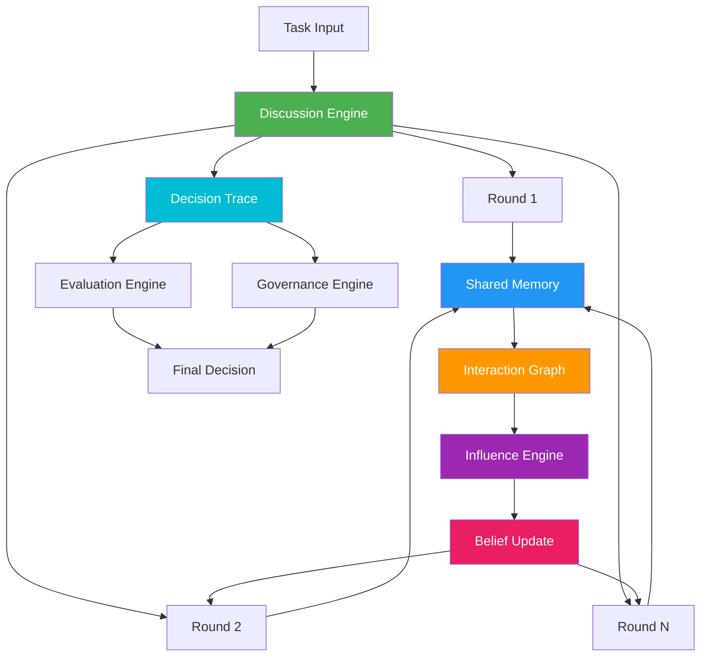
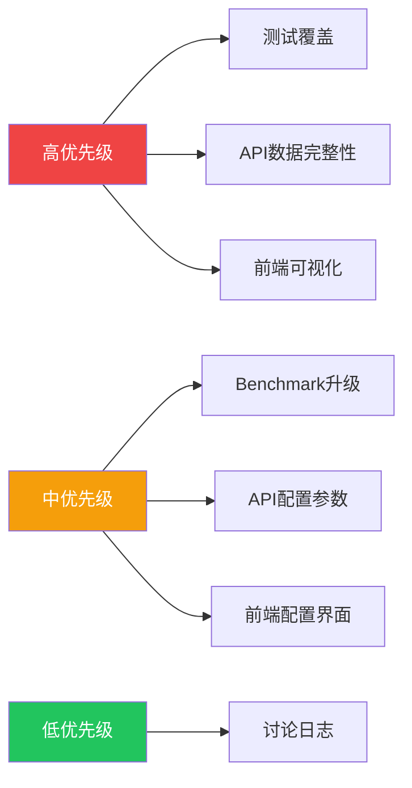

# SwarmAlpha V3 - Discussion Layer 完善计划

> 版本: 1.0  
> 更新时间: 2026-07-01  
> 状态: 待实施

---

## 一、项目概述

### 1.1 核心研究问题

> How can we evaluate and govern collective decision-making in LLM-based multi-agent systems?

SwarmAlpha V3 是一个面向科研的 LLM 多智能体集体决策评价与治理研究框架。

### 1.2 当前架构



### 1.3 已完成模块

| 模块 | 状态 | 文件路径 |
|------|------|----------|
| **Evaluation Engine** | ✅ 完成 | `src/lib/evaluation/` |
| **Governance Engine** | ✅ 完成 | `src/lib/governance/` |
| **Benchmark Interface** | ✅ 完成 | `src/lib/benchmarks/` |
| **LLM Provider** | ✅ 完成 | `src/lib/llm/providers.ts` |
| **Adapter Layer** | ✅ 完成 | `src/lib/adapters/` |
| **API (V3)** | ✅ 完成 | `src/app/api/v3/` |
| **Discussion Engine** | ✅ 完成 | `src/lib/discussion/` |
| **Tests** | ⚠️ 部分完成 | `test/` |

---

## 二、问题清单

### 2.1 测试覆盖率缺失（高优先级）

**问题描述**：新增的 Discussion Layer 完全没有测试覆盖，无法保证功能正确性。

| 模块 | 测试状态 | 问题描述 |
|------|----------|----------|
| `discussion/types.ts` | ❌ 缺失 | 类型定义未测试 |
| `discussion/memory.ts` | ❌ 缺失 | 共享内存读写未测试 |
| `discussion/beliefUpdate.ts` | ❌ 缺失 | 信念更新策略未测试 |
| `discussion/influence.ts` | ❌ 缺失 | 影响计算策略未测试 |
| `discussion/interactionGraph.ts` | ❌ 缺失 | 交互图构建未测试 |
| `discussion/decisionTrace.ts` | ❌ 缺失 | 决策轨迹生成未测试 |
| `discussion/index.ts` | ❌ 缺失 | 讨论引擎核心流程未测试 |

**影响**：无法验证讨论引擎的正确性，不利于后续策略扩展和论文实验。

**建议解决方案**：创建 `test/discussion.test.ts`，包含各模块的单元测试。

---

### 2.2 API 数据传递不完整（高优先级）

**问题描述**：当前 API 返回的交互历史仅包含单轮简化数据，缺少 Discussion Engine 生成的关键信息。

| 缺失数据项 | 数据来源 | 用途 |
|------------|----------|------|
| `roundResults` | Discussion Engine | 每轮讨论详细结果 |
| `decisionTrace` | DecisionTraceBuilder | 完整决策形成轨迹 |
| `interactionGraph` | InteractionGraphBuilder | Agent 交互关系图 |
| `beliefChanges` | BeliefUpdate | 每轮信念变化记录 |
| `influenceMap` | InfluenceEngine | Agent 间影响权重 |

**影响**：Evaluation 和 Governance 引擎无法获取真正的讨论数据进行深度分析，导致评价结果不够准确。

**建议解决方案**：升级 `execute/route.ts` 和 `task/route.ts`，传递完整的讨论数据。

---

### 2.3 前端可视化缺失（高优先级）

**问题描述**：前端仅展示了最终决策、评价结果、治理结果和 Agent 列表，缺少讨论过程的关键可视化。

| 缺失可视化 | 数据源 | 价值 |
|------------|--------|------|
| 讨论轮次展示 | `roundResults` | 观察多轮讨论过程 |
| 信念变化曲线 | `beliefChanges` | 展示 Agent 信念演变 |
| 交互图可视化 | `interactionGraph` | 可视化 Agent 间关系 |
| 影响链展示 | `influenceMap` | 展示谁影响了谁 |
| 决策时间线 | `decisionTrace` | 完整决策形成过程 |

**影响**：研究人员无法直观观察讨论过程，实验分析效率低。

**建议解决方案**：在 `page.tsx` 中添加讨论轮次展示、信念变化曲线、交互图等可视化组件。

---

### 2.4 Benchmark 未适配新架构（中优先级）

**问题描述**：当前 `financial.ts` 使用旧的单轮交互模式，未利用新的 Discussion Engine 进行多轮讨论。

| 升级项 | 说明 |
|--------|------|
| 多轮讨论支持 | 使用 Discussion Engine 进行多轮讨论 |
| 策略对比测试 | 测试不同策略（Rule-based / Bayesian / Graph） |
| 过程数据收集 | 收集讨论过程数据进行对比分析 |
| 参数敏感性测试 | 测试不同轮次、阈值对结果的影响 |

**影响**：基准测试无法评估多轮讨论的效果，科研价值受限。

**建议解决方案**：升级 `financial.ts`，使用 Discussion Engine 进行多轮讨论测试。

---

### 2.5 API 缺少讨论配置参数（中优先级）

**问题描述**：当前 API 无法配置讨论参数，所有参数硬编码在 `custom.ts` 中。

```typescript
// src/lib/adapters/custom.ts 第144-150行
const discussionConfig: DiscussionConfig = {
  maxRounds: 3,
  convergenceThreshold: 0.15,
  beliefUpdateStrategy: "rule_based",
  influenceStrategy: "rule_based",
  memoryStrategy: "in_memory",
};
```

**需要开放的配置参数**：

| 参数 | 类型 | 默认值 | 说明 |
|------|------|--------|------|
| `maxRounds` | number | 3 | 最大讨论轮数 |
| `convergenceThreshold` | number | 0.15 | 收敛阈值 |
| `beliefUpdateStrategy` | string | "rule_based" | 信念更新策略 |
| `influenceStrategy` | string | "rule_based" | 影响计算策略 |
| `memoryStrategy` | string | "in_memory" | 内存策略 |

**影响**：用户无法调整讨论策略，限制了实验灵活性。

**建议解决方案**：在 API 请求中添加 `discussionConfig` 参数，传递给 Discussion Engine。

---

### 2.6 前端缺少策略配置界面（中优先级）

**问题描述**：前端缺少讨论策略配置面板，用户无法选择讨论参数。

**需要添加的配置项**：

- 讨论轮数（2-10轮）
- 信念更新策略（Rule-based / Bayesian / Graph）
- 影响策略（Rule-based / Graph / Learned）
- 收敛条件

**影响**：用户只能使用默认配置，无法进行对比实验。

**建议解决方案**：在前端添加策略配置面板，与 API 配置参数对应。

---

### 2.7 缺少讨论过程日志（低优先级）

**问题描述**：缺少讨论过程的实时日志输出，不利于研究人员观察讨论动态。

**需要的功能**：

- 讨论轮次日志
- Agent 发言记录
- 信念变化记录
- 影响计算日志

**影响**：调试和实验记录不方便。

**建议解决方案**：添加讨论过程日志组件，实时展示讨论动态。

---

## 三、优先级矩阵



---

## 四、建议实施顺序

### 阶段 1：核心基础（测试 + API数据）

| 步骤 | 任务 | 预计时间 | 状态 |
|------|------|----------|------|
| 1.1 | 创建 `test/discussion.test.ts` | 2h | ❌ |
| 1.2 | 升级 `execute/route.ts` 传递完整数据 | 1h | ❌ |
| 1.3 | 升级 `task/route.ts` 传递完整数据 | 1h | ❌ |
| 1.4 | 验证构建与测试 | 0.5h | ❌ |

### 阶段 2：可视化增强

| 步骤 | 任务 | 预计时间 | 状态 |
|------|------|----------|------|
| 2.1 | 添加讨论轮次展示组件 | 2h | ❌ |
| 2.2 | 添加信念变化曲线组件 | 2h | ❌ |
| 2.3 | 添加交互图可视化组件 | 2h | ❌ |
| 2.4 | 添加决策时间线组件 | 2h | ❌ |

### 阶段 3：配置能力

| 步骤 | 任务 | 预计时间 | 状态 |
|------|------|----------|------|
| 3.1 | API 支持讨论配置参数 | 1h | ❌ |
| 3.2 | 前端添加策略配置面板 | 2h | ❌ |

### 阶段 4：扩展与优化

| 步骤 | 任务 | 预计时间 | 状态 |
|------|------|----------|------|
| 4.1 | 升级 Benchmark 适配新架构 | 3h | ❌ |
| 4.2 | 添加讨论过程日志 | 1h | ❌ |

---

## 五、预期收益

### 5.1 科研价值提升

| 指标 | 当前状态 | 完善后 |
|------|----------|--------|
| 讨论数据完整性 | 单轮简化数据 | 多轮完整过程数据 |
| 可重复性 | 低 | 高（完整轨迹记录） |
| 对比分析能力 | 有限 | 强（多策略对比） |
| 实验可配置性 | 固定参数 | 灵活配置 |

### 5.2 架构完善度

| 维度 | 当前评分 | 完善后评分 |
|------|----------|------------|
| 测试覆盖率 | 60% | 90%+ |
| API 数据完整性 | 40% | 90%+ |
| 前端可视化 | 30% | 70%+ |
| 配置灵活性 | 20% | 70%+ |

---

## 六、风险评估

| 风险 | 影响 | 缓解措施 |
|------|------|----------|
| 测试编写复杂度 | 中 | 优先编写单元测试，逐步扩展集成测试 |
| API 兼容性问题 | 低 | 保持向后兼容，新增字段而非修改现有字段 |
| 前端性能问题 | 低 | 分页加载讨论轮次，按需渲染图表 |
| Benchmark 执行时间 | 中 | 异步执行，提供进度反馈 |

---

## 七、变更记录

| 版本 | 日期 | 变更内容 | 作者 |
|------|------|----------|------|
| 1.0 | 2026-07-01 | 初始版本，包含问题清单与实施计划 | System |

---

## 八、下一步行动

建议优先执行**阶段 1**，因为：

1. **测试覆盖**是保证代码质量的基础，特别是新增的 Discussion Layer
2. **API 数据完整性**是后续所有可视化和分析功能的前提
3. 这两个任务相对独立，完成后可以立即验证效果

如需开始实施，请确认是否按此顺序执行，或调整优先级。
