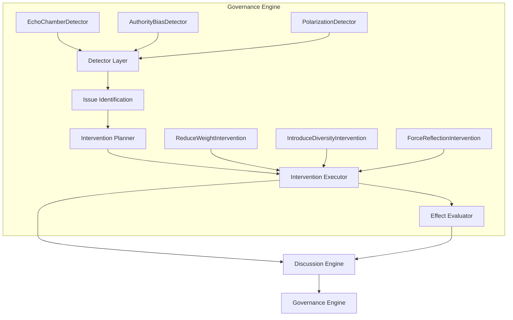
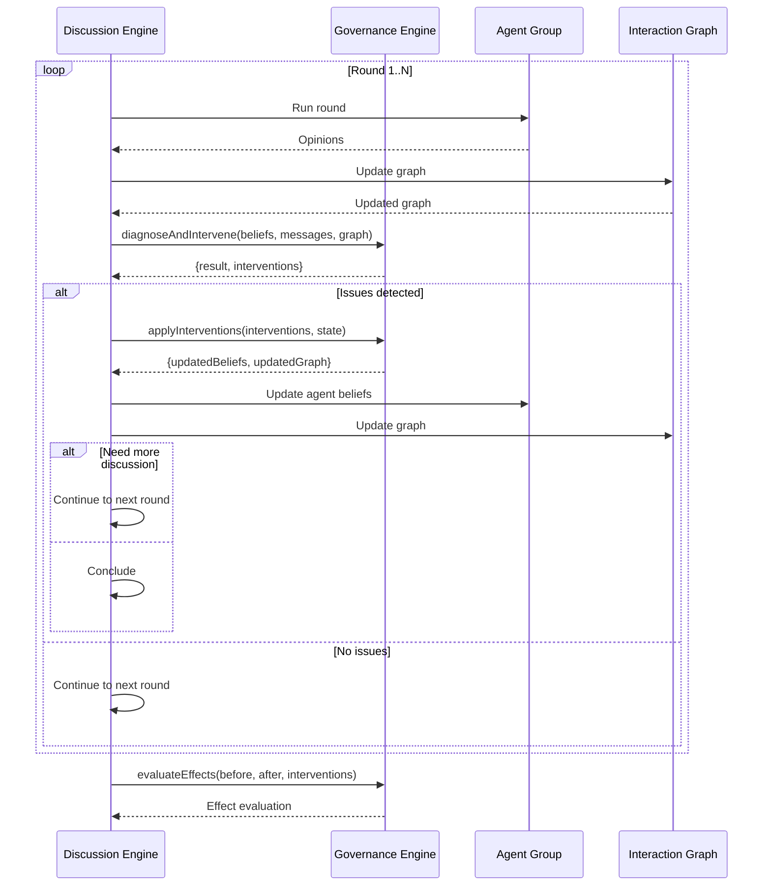

# Governance Refactor Proposal

> 版本: 2.0  
> 更新时间: 2026-07-02  
> 状态: 审查完成 | 改进已实施

---

## 一、当前状态分析

### 1.1 当前 Governance Engine 定位

**当前 Governance Engine 已经升级为真正的治理引擎，具备完整的干预能力。**

| 功能 | 当前状态 | 期望状态 |
|------|----------|----------|
| 问题检测 | ✅ | ✅ |
| 干预决策 | ✅ | ✅ |
| 执行干预 | ✅ | ✅ |
| 干预效果评估 | ✅ | ✅ |
| 自适应治理 | ❌ | ✅ |

### 1.2 三个检测模块分析

#### Echo Chamber Detection

**当前实现**：[index.ts#L100-L173](file:///C:/Users/贺孟元/Desktop/swarmalpha/src/lib/governance/index.ts#L100-L173)

| 方面 | 当前状态 | 评价 |
|------|----------|------|
| 检测方法 | ✅ | 基于信念相似度和内容相似度 |
| 干预机制 | ✅ | 引入多样性（IntroduceDiversityIntervention） |
| 干预效果 | ✅ | evaluateEffects() 量化评估 |

#### Authority Bias Detection

**当前实现**：[index.ts#L175-L242](file:///C:/Users/贺孟元/Desktop/swarmalpha/src/lib/governance/index.ts#L175-L242)

| 方面 | 当前状态 | 评价 |
|------|----------|------|
| 检测方法 | ✅ | 基于消息数量比例 |
| 干预机制 | ✅ | 降低权重（ReduceWeightIntervention） |
| 干预效果 | ✅ | evaluateEffects() 量化评估 |

#### Polarization Detection

**当前实现**：[index.ts#L244-L305](file:///C:/Users/贺孟元/Desktop/swarmalpha/src/lib/governance/index.ts#L244-L305)

| 方面 | 当前状态 | 评价 |
|------|----------|------|
| 检测方法 | ✅ | 基于信念标准差聚类 |
| 干预机制 | ✅ | 强制反思（ForceReflectionIntervention） |
| 干预效果 | ✅ | evaluateEffects() 量化评估 |

---

## 二、核心改进：从 Detection 升级到 Intervention

### 2.1 已实现的执行式干预

当前 Governance Engine 已经实现了**执行式干预**：

```typescript
// 当前实现 - 真正执行干预并评估效果
const { result, interventions } = this.governanceEngine.diagnoseAndIntervene(
  agentBeliefs,
  messages,
  agentIds,
  interactionGraph
);

const results = this.governanceEngine.applyInterventions(interventions, state);

const effectMetrics = this.governanceEngine.evaluateEffects(
  beforeState,
  afterState,
  results.map(r => r.intervention)
);
```

### 2.2 干预策略实现

#### Authority Bias → ReduceWeightIntervention

```typescript
export class ReduceWeightIntervention implements InterventionStrategy {
  type: InterventionType = "reduce_weight";
  
  apply(
    intervention: Intervention,
    state: GovernanceState
  ): InterventionResult {
    const { targetAgentId, parameters } = intervention;
    const reductionFactor = parameters?.reductionFactor as number || 0.5;
    
    // 降低目标 Agent 的所有出边权重
    const updatedEdges = state.interactionGraph?.edges.map(edge => {
      if (edge.source === targetAgentId) {
        return { ...edge, weight: edge.weight * (1 - reductionFactor) };
      }
      return edge;
    }) || [];
    
    return {
      success: true,
      intervention: { ...intervention, applied: true },
      stateChanges: {
        updatedEdges,
      },
    };
  }
}
```

#### Echo Chamber → IntroduceDiversityIntervention

```typescript
export class IntroduceDiversityIntervention implements InterventionStrategy {
  type: InterventionType = "introduce_diversity";
  
  apply(
    intervention: Intervention,
    state: GovernanceState
  ): InterventionResult {
    const { targetAgents, parameters } = intervention;
    const perturbationAmount = parameters?.perturbationAmount as number || 0.3;
    
    // 对目标 Agent 的信念进行扰动，增加多样性
    const updatedBeliefs = state.agentBeliefs.map(belief => {
      if (targetAgents?.includes(belief.agentId)) {
        const perturbation = (Math.random() - 0.5) * perturbationAmount * 2;
        return {
          ...belief,
          belief: Math.max(-1, Math.min(1, belief.belief + perturbation)),
        };
      }
      return belief;
    });
    
    return {
      success: true,
      intervention: { ...intervention, applied: true },
      stateChanges: {
        updatedBeliefs,
      },
    };
  }
}
```

#### Polarization → ForceReflectionIntervention

```typescript
export class ForceReflectionIntervention implements InterventionStrategy {
  type: InterventionType = "force_reflection";
  
  apply(
    intervention: Intervention,
    state: GovernanceState
  ): InterventionResult {
    const { targetAgents, parameters } = intervention;
    const reflectionFactor = parameters?.reflectionFactor as number || 0.2;
    
    // 强制极端观点的 Agent 反思，向相反方向微调
    const updatedBeliefs = state.agentBeliefs.map(belief => {
      if (targetAgents?.includes(belief.agentId)) {
        const reflection = -belief.belief * reflectionFactor;
        return {
          ...belief,
          belief: Math.max(-1, Math.min(1, belief.belief + reflection)),
          confidence: Math.max(0, belief.confidence - reflectionFactor * 10),
        };
      }
      return belief;
    });
    
    return {
      success: true,
      intervention: { ...intervention, applied: true },
      stateChanges: {
        updatedBeliefs,
      },
    };
  }
}
```

---

## 三、当前架构

### 3.1 架构图



### 3.2 核心类型定义

```typescript
export type InterventionType = 
  | "introduce_diversity" 
  | "break_connections" 
  | "reduce_weight" 
  | "introduce_dissent" 
  | "pair_opposites" 
  | "force_reflection"
  | "continue_discussion"
  | "none";

export interface Intervention {
  type: InterventionType;
  targetAgentId?: string;
  targetAgents?: string[];
  parameters?: Record<string, unknown>;
  effect: string;
  applied: boolean;
}

export interface InterventionStrategy {
  type: InterventionType;
  apply(
    intervention: Intervention,
    state: GovernanceState
  ): InterventionResult;
}

export interface InterventionResult {
  success: boolean;
  intervention: Intervention;
  stateChanges?: {
    updatedBeliefs?: AgentBelief[];
    updatedEdges?: Array<{ source: string; target: string; weight: number; type: string }>;
    newAgents?: AgentBelief[];
  };
}
```

---

## 四、新 Governance Engine 接口

### 4.1 核心方法

```typescript
export class GovernanceEngine {
  diagnose(
    agentBeliefs: AgentBelief[],
    messages: MessageInfo[],
    agentIds: string[],
    config?: GovernanceConfig
  ): GovernanceResult;
  
  detectIssues(
    agentBeliefs: AgentBelief[],
    messages: MessageInfo[],
    agentIds: string[],
    interactionGraph: InteractionGraph
  ): GovernanceIssue[];
  
  planInterventions(issues: GovernanceIssue[]): Intervention[];
  
  executeInterventions(
    interventions: Intervention[],
    state: GovernanceState
  ): InterventionResult[];
  
  evaluateEffects(
    beforeState: GovernanceState,
    afterState: GovernanceState,
    interventions: Intervention[]
  ): Record<string, number>;
  
  diagnoseAndIntervene(
    agentBeliefs: AgentBelief[],
    messages: MessageInfo[],
    agentIds: string[],
    interactionGraph?: InteractionGraph["interactionGraph"],
    config?: GovernanceConfig
  ): { result: GovernanceResult; interventions: Intervention[] };
}
```

---

## 五、与 Discussion Engine 的集成

### 5.1 集成点

| 集成点 | 说明 | 状态 |
|--------|------|------|
| 每轮结束检测 | Discussion Engine 在每轮结束后调用 Governance Engine | ✅ |
| 干预执行 | Governance Engine 修改 Agent 信念和交互图 | ✅ |
| 继续讨论判断 | Governance Engine 可以决定是否继续讨论 | ⚠️ |
| 效果反馈 | Discussion Engine 将干预后的结果反馈给 Governance Engine | ✅ |

### 5.2 集成流程



---

## 六、干预效果评估

### 6.1 评估指标

| 指标 | 说明 | 计算方式 |
|------|------|----------|
| belief_diversity_change | 干预前后信念多样性变化 | afterStd - beforeStd |
| belief_mean_change | 干预前后信念均值变化 | afterMean - beforeMean |
| avg_confidence_change | 干预前后平均置信度变化 | afterConfidence - beforeConfidence |
| successful_interventions | 成功执行的干预数量 | count of successful interventions |
| total_influence_weight_change | 干预前后总影响力权重变化 | afterWeight - beforeWeight |

### 6.2 评估代码

```typescript
evaluateEffects(
  beforeState: GovernanceState,
  afterState: GovernanceState,
  interventions: Intervention[]
): Record<string, number> {
  const effects: Record<string, number> = {};

  const beforeBeliefs = beforeState.agentBeliefs.map(b => b.belief);
  const afterBeliefs = afterState.agentBeliefs.map(b => b.belief);

  const beforeStd = this.computeStd(beforeBeliefs);
  const afterStd = this.computeStd(afterBeliefs);
  effects["belief_diversity_change"] = afterStd - beforeStd;

  const beforeMean = beforeBeliefs.reduce((sum, b) => sum + b, 0) / beforeBeliefs.length;
  const afterMean = afterBeliefs.reduce((sum, b) => sum + b, 0) / afterBeliefs.length;
  effects["belief_mean_change"] = afterMean - beforeMean;

  const successfulInterventions = interventions.filter(i => i.applied).length;
  effects["successful_interventions"] = successfulInterventions;

  return effects;
}
```

---

## 七、待改进项

### 7.1 高优先级改进

| 改进项 | 说明 | 代码位置 |
|--------|------|----------|
| Premature Consensus 检测 | 检测过早达成的共识 | `governance/index.ts` |
| ContinueDiscussion 干预 | 自动增加讨论轮数 | `governance/interventions/` |
| 干预策略参数优化 | 自适应调整干预参数 | `governance/` |

### 7.2 中优先级改进

| 改进项 | 说明 |
|--------|------|
| 自适应学习 | 基于历史数据优化治理策略 |
| 干预优先级排序 | 根据问题严重程度排序干预 |
| 组合干预策略 | 同时执行多种干预 |

### 7.3 低优先级改进

| 改进项 | 说明 |
|--------|------|
| 干预效果预测 | 预测干预后的效果 |
| 治理策略对比 | 对比不同治理策略的效果 |
| 多轮干预优化 | 多轮干预的协同优化 |

---

## 八、科研价值评估

### 8.1 能力矩阵

| 科研能力 | 当前状态 | 评分 |
|----------|----------|------|
| 干预能力 | 完整 | 8/10 |
| 效果评估 | 完整 | 7/10 |
| 自适应治理 | 无 | 2/10 |
| 可研究性 | 高 | 8/10 |

### 8.2 下游模块收益

| 模块 | 收益 |
|------|------|
| Discussion Engine | 可在讨论过程中进行实时干预 |
| Evaluation Engine | 可评估干预对评价指标的影响 |
| Benchmark | 可测试不同治理策略的效果 |
| Decision Trace | 可记录干预事件和效果 |

---

## 九、结论

当前 Governance Engine 已经从「检测引擎」升级为「治理引擎」，**具备完整的干预能力**。

主要成就：
1. **InterventionStrategy** - 可插拔的干预策略接口
2. **执行式干预** - 真正执行干预而非只是标记
3. **效果评估** - evaluateEffects() 量化评估干预效果
4. **三种干预策略** - ReduceWeight、IntroduceDiversity、ForceReflection
5. **与 Discussion Engine 集成** - 实时检测和干预

主要待改进点：
1. **自适应治理** - 基于历史数据优化治理策略
2. **Premature Consensus 检测** - 检测过早达成的共识
3. **ContinueDiscussion 干预** - 自动增加讨论轮数

**当前评分：7.5/10**，已具备高水平的治理干预能力。