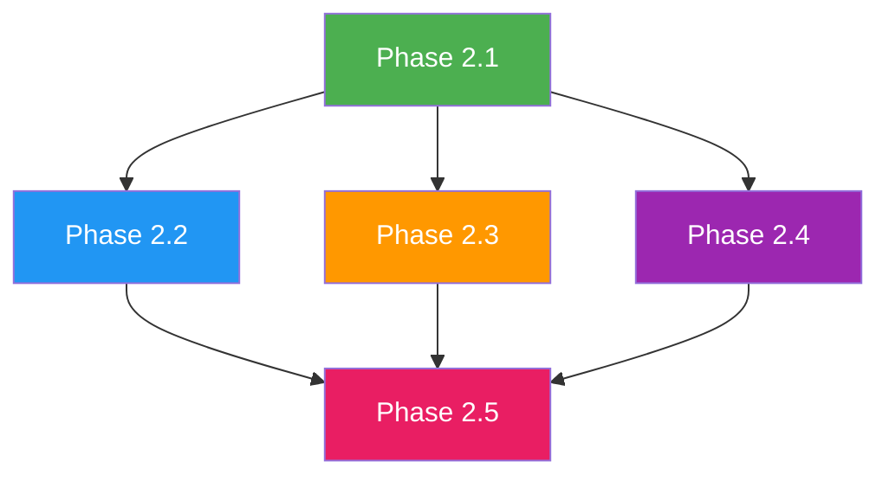

# SwarmAlpha V3 Phase 2 Implementation Plan

> 版本: 1.0  
> 更新时间: 2026-07-02  
> 状态: 待确认  
> 参考文档: [Research Roadmap](file:///C:/Users/贺孟元/Desktop/swarmalpha/docs/PRIORITY_ROADMAP.md)

---

## 一、实施原则

### 1.1 核心原则

| 原则 | 说明 |
|------|------|
| **独立可交付** | 每个阶段可独立开发、测试、提交 |
| **向后兼容** | 所有修改保持与现有 API 和模块兼容 |
| **测试优先** | 每个阶段必须包含完整测试用例 |
| **文档驱动** | 每个阶段完成后更新相关文档 |
| **增量推进** | 不进行一次性大规模重构 |

### 1.2 验证流程

每个阶段完成后必须执行：

```
Build → Test → Review → Documentation → Confirm
```

---

## 二、阶段规划总览

| 阶段 | 名称 | 预计时间 | 核心任务 | 风险等级 |
|------|------|----------|----------|----------|
| Phase 2.1 | Discussion Layer 基础修复 | 2-3 天 | 修复 roundNumber、同步 Agent 状态、扩大 Memory、传递 Influence 权重 | 低 |
| Phase 2.2 | Decision Trace 增强 | 3-4 天 | 完善 InfluenceRecord、CausalFactor、ConsensusEvent、查询方法 | 低 |
| Phase 2.3 | Governance Engine 升级 | 3-4 天 | 完善干预执行、新增 Premature Consensus 检测、干预效果评估增强 | 中 |
| Phase 2.4 | Evaluation Engine 提升 | 3-4 天 | 动态共识追踪、影响路径分析、统计可靠性指标 | 中 |
| Phase 2.5 | 架构完善与数据流优化 | 2-3 天 | 数据模型统一、策略层完善、可观测性增强 | 低 |

---

## 三、Phase 2.1: Discussion Layer 基础修复

### 3.1 目标

修复 Discussion Engine 中阻碍真正集体决策形成的基础问题。

### 3.2 任务清单

| 序号 | 任务 | 代码位置 | 详细说明 | 验收标准 |
|------|------|----------|----------|----------|
| D1 | 验证 roundNumber 传递正确性 | `discussion/index.ts` | 确认 roundNumber 正确传递到信念更新和 Memory | 每轮 roundNumber 递增且正确显示 |
| D2 | 验证 Agent 状态同步 | `discussion/index.ts` | 确认 agentStates Map 与 Agent 实例状态一致 | getState() 返回最新状态 |
| D3 | 扩大 Memory 截断长度 | `discussion/index.ts` | 当前 reasoning 截断 500 字符，确保完整历史传递 | 完整显示历史讨论内容 |
| D4 | 传递 Influence 权重到信念更新 | `discussion/index.ts` | 确保 influenceWeights 正确传递到 beliefUpdateManager | 影响权重参与信念计算 |

### 3.3 关键修改点

#### 3.3.1 Memory 内容完整性

**位置**: `discussion/index.ts` → `buildPrompt()`

```typescript
// 当前实现 - 仅显示 reasoning
memoryContext += `- Agent ${entry.agentId}: ${entry.reasoning} (belief: ${entry.belief.toFixed(2)})\n`;

// 改进后 - 增加信念和置信度变化
memoryContext += `- Agent ${entry.agentId} (belief: ${entry.belief.toFixed(2)}, confidence: ${entry.confidence}): ${entry.reasoning}\n`;
```

#### 3.3.2 Influence 权重传递

**位置**: `discussion/index.ts` → `updateBeliefs()`

当前已实现，需验证影响权重确实参与信念更新计算。

### 3.4 测试计划

| 测试用例 | 预期结果 |
|----------|----------|
| 多轮讨论 roundNumber 递增 | 每轮 roundNumber 正确显示 |
| Agent 状态更新后可读取 | getState() 返回更新后的值 |
| Memory 包含完整历史 | 第3轮可见第1、2轮完整内容 |
| Influence 权重作用 | 高权重 Agent 影响低权重 Agent 信念 |

### 3.5 交付物

- [ ] 修复后的 `discussion/index.ts`
- [ ] 更新的测试用例 `test/discussion.test.ts`
- [ ] 更新的 `DISCUSSION_ARCHITECTURE_REVIEW.md`

---

## 四、Phase 2.2: Decision Trace 增强

### 4.1 目标

让 Decision Trace 能够回答核心科研问题：Who influenced whom? When? Why? Belief changed because of what?

### 4.2 任务清单

| 序号 | 任务 | 代码位置 | 详细说明 | 验收标准 |
|------|------|----------|----------|----------|
| T1 | 完善 InfluenceRecord 记录 | `discussion/decisionTrace.ts` | 确保每条影响记录包含完整信息 | answerWhoInfluencedWhom() 返回完整记录 |
| T2 | 增强 CausalFactor 追踪 | `discussion/decisionTrace.ts` | 增加 evidence 和 self_reflection 类型追踪 | answerWhy() 返回多种因素 |
| T3 | 完善 ConsensusEvent 检测 | `discussion/decisionTrace.ts` | 增加分歧解决事件追踪 | answerConsensusEmergedAt() 返回正确轮次 |
| T4 | 实现冲突解决追踪 | `discussion/decisionTrace.ts` | 检测冲突解决时刻 | 新增 answerConflictResolvedAt() 方法 |

### 4.3 关键修改点

#### 4.3.1 新增冲突解决追踪方法

**位置**: `discussion/decisionTrace.ts`

```typescript
answerConflictResolvedAt(): { roundNumber: number; timestamp: string; description: string } | null {
  const events = this.consensusEvents;
  for (let i = 1; i < events.length; i++) {
    if (events[i].consensusLevel > events[i-1].consensusLevel + 0.3) {
      return {
        roundNumber: events[i].roundNumber,
        timestamp: events[i].timestamp,
        description: `冲突在第 ${events[i].roundNumber} 轮解决，共识度从 ${events[i-1].consensusLevel.toFixed(2)} 提升到 ${events[i].consensusLevel.toFixed(2)}`,
      };
    }
  }
  return null;
}
```

#### 4.3.2 增强 CausalFactor 提取

**位置**: `discussion/decisionTrace.ts` → `extractCausalFactors()`

当前已实现多种因素类型，需验证完整性。

### 4.4 测试计划

| 测试用例 | 预期结果 |
|----------|----------|
| Who influenced whom | 返回源Agent、目标Agent、权重 |
| When | 返回时间戳和轮次 |
| Why | 返回多种因果因素 |
| Belief changed because of | 返回指定轮次的变化原因 |
| Consensus emerged at | 返回共识达成的轮次 |
| Conflict resolved at | 返回冲突解决的轮次 |

### 4.5 交付物

- [ ] 增强的 `decisionTrace.ts`
- [ ] 更新的测试用例 `test/discussion.test.ts`
- [ ] 更新的 `DECISION_TRACE_REVIEW.md`

---

## 五、Phase 2.3: Governance Engine 升级

### 5.1 目标

从检测升级到干预，实现完整的治理闭环。

### 5.2 任务清单

| 序号 | 任务 | 代码位置 | 详细说明 | 验收标准 |
|------|------|----------|----------|----------|
| G1 | 新增 Premature Consensus 检测 | `governance/index.ts` | 检测过早达成的共识 | 新增检测方法 |
| G2 | 新增 ContinueDiscussion 干预 | `governance/interventions/` | 自动增加讨论轮数 | 干预后继续讨论 |
| G3 | 增强干预效果评估 | `governance/index.ts` | 增加更多评估指标 | evaluateEffects() 返回完整指标 |
| G4 | 干预策略参数优化 | `governance/types.ts` | 支持自适应参数调整 | 参数可配置 |

### 5.3 关键修改点

#### 5.3.1 Premature Consensus 检测

**位置**: `governance/index.ts`

```typescript
detectPrematureConsensus(
  agentBeliefs: AgentBelief[],
  roundNumber: number,
  maxRounds: number,
  config: GovernanceConfig
): PrematureConsensusDetection {
  if (roundNumber < maxRounds * 0.5) {
    const beliefs = agentBeliefs.map(b => b.belief);
    const std = this.computeStd(beliefs);
    if (std < 0.15) {
      return {
        detected: true,
        severity: "medium",
        roundNumber,
        beliefStd: std,
        intervention: { type: "continue_discussion", applied: true },
      };
    }
  }
  return {
    detected: false,
    severity: "low",
    roundNumber,
    beliefStd: 0,
    intervention: { type: "none", applied: false },
  };
}
```

#### 5.3.2 ContinueDiscussion 干预策略

**位置**: `governance/interventions/continueDiscussion.ts`

```typescript
export class ContinueDiscussionIntervention implements InterventionStrategy {
  type: InterventionType = "continue_discussion";
  
  apply(
    intervention: Intervention,
    state: GovernanceState
  ): InterventionResult {
    return {
      success: true,
      intervention: { ...intervention, applied: true },
      stateChanges: {},
    };
  }
}
```

### 5.4 测试计划

| 测试用例 | 预期结果 |
|----------|----------|
| Premature Consensus 检测 | 早期达成共识时触发检测 |
| ContinueDiscussion 干预 | 干预后讨论继续进行 |
| 干预效果评估 | 返回完整指标集 |
| 干预参数配置 | 参数正确应用 |

### 5.5 交付物

- [ ] 更新的 `governance/index.ts`
- [ ] 新增 `governance/interventions/continueDiscussion.ts`
- [ ] 更新的 `governance/types.ts`
- [ ] 更新的测试用例 `test/governance.test.ts`
- [ ] 更新的 `GOVERNANCE_REFACTOR_PROPOSAL.md`

---

## 六、Phase 2.4: Evaluation Engine 提升

### 6.1 目标

从工程指标升级为科学指标，提升科研价值。

### 6.2 任务清单

| 序号 | 任务 | 代码位置 | 详细说明 | 验收标准 |
|------|------|----------|----------|----------|
| E1 | 动态共识追踪完善 | `evaluation/index.ts` | 确保每轮共识度变化正确记录 | consensus.trajectory 完整 |
| E2 | 影响路径分析增强 | `evaluation/index.ts` | 增加完整路径追踪 | influencePaths 完整 |
| E3 | 统计可靠性指标增强 | `evaluation/index.ts` | 完善 Cronbach's alpha 计算 | alpha 值合理 |
| E4 | 真正的交叉验证 | `evaluation/index.ts` | 支持多次运行测量 | 可重复性指标正确 |

### 6.3 关键修改点

#### 6.3.1 真正的交叉验证

**位置**: `evaluation/index.ts`

```typescript
evaluateCrossValidation(
  agentDecisions: AgentDecision[],
  interactionHistory: InteractionRound[],
  runs: number = 3
): { score: number; consistencyAcrossRuns: number; variance: number } {
  const results: number[] = [];
  
  for (let i = 0; i < runs; i++) {
    const sampleSize = Math.floor(agentDecisions.length * 0.8);
    const shuffled = [...agentDecisions].sort(() => Math.random() - 0.5);
    const sample = shuffled.slice(0, sampleSize);
    
    const beliefs = sample.map(d => d.belief || 0);
    const mean = beliefs.reduce((a, b) => a + b, 0) / beliefs.length;
    const std = Math.sqrt(beliefs.reduce((sum, b) => sum + Math.pow(b - mean, 2), 0) / beliefs.length);
    results.push(1 - std);
  }
  
  const meanResult = results.reduce((a, b) => a + b, 0) / results.length;
  const variance = results.reduce((sum, r) => sum + Math.pow(r - meanResult, 2), 0) / results.length;
  
  return {
    score: Math.round(meanResult * 100),
    consistencyAcrossRuns: meanResult,
    variance: Math.round(variance * 1000) / 1000,
  };
}
```

### 6.4 测试计划

| 测试用例 | 预期结果 |
|----------|----------|
| 动态共识追踪 | 每轮共识度变化正确记录 |
| 影响路径分析 | 完整追踪影响传播路径 |
| Cronbach's alpha | 值在 0-1 之间，符合统计标准 |
| 交叉验证 | 多次运行结果一致 |

### 6.5 交付物

- [ ] 更新的 `evaluation/index.ts`
- [ ] 更新的测试用例 `test/evaluation.test.ts`
- [ ] 更新的 `EVALUATION_REVIEW_REPORT.md`

---

## 七、Phase 2.5: 架构完善与数据流优化

### 7.1 目标

确保架构符合科研平台要求，数据流动完整。

### 7.2 任务清单

| 序号 | 任务 | 代码位置 | 详细说明 | 验收标准 |
|------|------|----------|----------|----------|
| A1 | 数据模型统一验证 | `discussion/types.ts` | 确保 DiscussionData 模型完整 | 所有字段正确定义 |
| A2 | 数据流优化 | `discussion/index.ts` | 确保 Trace → Evaluation/Governance 数据完整 | 数据正确传递 |
| A3 | 策略层完善 | `discussion/strategyRegistry.ts` | 确保策略注册机制完整 | 策略可动态注册 |
| A4 | 可观测性增强 | `discussion/eventTracker.ts` | 确保事件追踪系统完整 | 所有事件类型可追踪 |

### 7.3 关键修改点

#### 7.3.1 策略注册机制完善

**位置**: `discussion/strategyRegistry.ts`

当前已实现，需验证策略注册和获取功能正常。

#### 7.3.2 数据流接口标准化

**位置**: `discussion/types.ts`

当前已定义 `DataProvider` 接口，需确保 DiscussionEngine 实现该接口。

### 7.4 测试计划

| 测试用例 | 预期结果 |
|----------|----------|
| 数据模型统一 | DiscussionData 包含所有必需字段 |
| 数据流完整 | Trace 数据正确传递到 Evaluation/Governance |
| 策略注册 | 策略可动态注册和获取 |
| 事件追踪 | 所有事件类型正确记录 |

### 7.5 交付物

- [ ] 更新的 `discussion/types.ts`
- [ ] 更新的 `discussion/index.ts`
- [ ] 更新的 `discussion/strategyRegistry.ts`
- [ ] 更新的 `discussion/eventTracker.ts`
- [ ] 更新的 `ARCHITECTURE_IMPROVEMENT_PROPOSAL.md`

---

## 八、阶段依赖关系



**依赖说明**:
- Phase 2.1 是基础，必须先完成
- Phase 2.2、2.3、2.4 可并行开发
- Phase 2.5 依赖其他所有阶段完成

---

## 九、风险评估

### 9.1 高风险项

| 风险项 | 影响 | 缓解措施 |
|--------|------|----------|
| 类型变更影响现有 API | 可能破坏外部调用 | 保持向后兼容，逐步替换 |
| 干预机制破坏讨论流程 | 可能产生意外结果 | 先实现轻量级干预，逐步增加强度 |

### 9.2 中风险项

| 风险项 | 影响 | 缓解措施 |
|--------|------|----------|
| 数据量增加 | 可能影响性能 | 提供精简模式选项 |
| 测试覆盖不足 | 可能遗漏问题 | 每阶段编写完整测试用例 |

### 9.3 低风险项

| 风险项 | 影响 | 缓解措施 |
|--------|------|----------|
| 代码复杂度增加 | 维护难度上升 | 保持接口简洁，文档完善 |
| 重构影响现有功能 | 可能引入回归 | 严格执行测试流程 |

---

## 十、科研价值预期

### 10.1 阶段完成后能力矩阵

| 科研能力 | 当前状态 | Phase 2.1 | Phase 2.2 | Phase 2.3 | Phase 2.4 | Phase 2.5 |
|----------|----------|-----------|-----------|-----------|-----------|-----------|
| 集体决策形成分析 | 低 | 中 | 高 | 高 | 高 | 高 |
| 影响传播分析 | 低 | 中 | 高 | 高 | 高 | 高 |
| 共识形成追踪 | 低 | 中 | 高 | 高 | 高 | 高 |
| 干预策略研究 | 无 | 无 | 低 | 高 | 高 | 高 |
| 算法对比测试 | 低 | 中 | 中 | 中 | 高 | 高 |
| 实验可复现性 | 低 | 中 | 高 | 高 | 高 | 高 |

### 10.2 预期成果

完成所有阶段后，SwarmAlpha 将具备：

1. **完整的决策过程追溯** - 能够回答 Who/When/Why/Because of what
2. **真正的集体决策** - Agent 之间存在真实的影响和信念变化
3. **可干预的治理机制** - 能够执行不同的治理策略并评估效果
4. **科学的评价指标** - 基于学术界认可的指标进行评估
5. **插件化架构** - 支持不同算法和策略的对比实验

---

## 十一、确认清单

在开始实施前，请确认以下内容：

- [ ] 已阅读并理解所有审查文档和 Roadmap
- [ ] 同意阶段划分和实施顺序
- [ ] 确认每个阶段的验证流程（Build → Test → Review → Documentation）
- [ ] 确认资源和时间安排

确认后，请回复 "确认"，开始 Phase 2.1 实施。