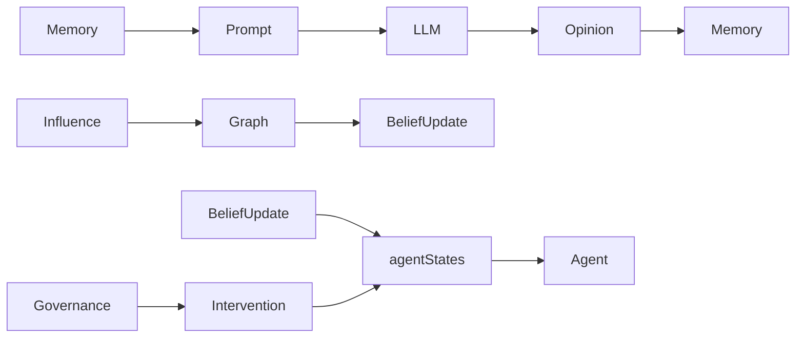
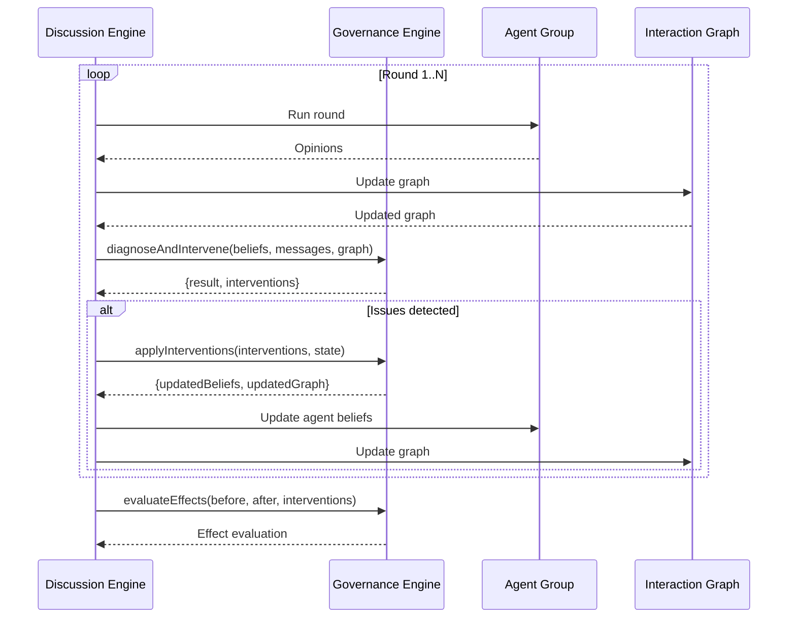
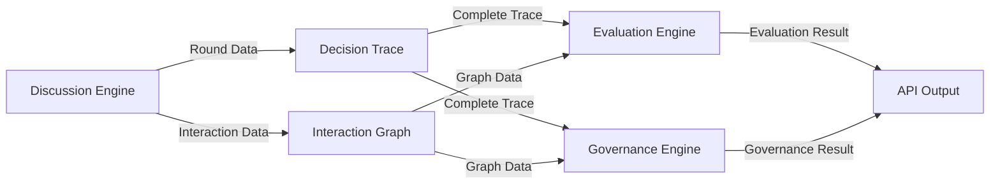
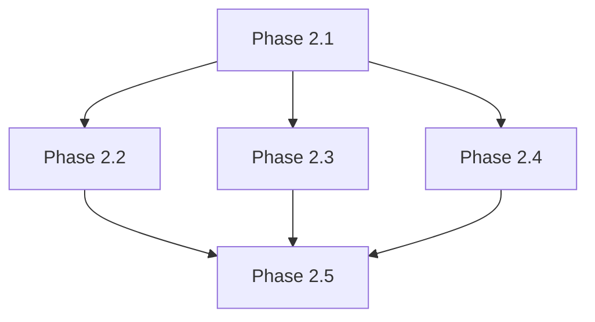

# SwarmAlpha V3 Phase 2 —— 综合模块总结

> 版本: 1.5  
> 更新时间: 2026-07-02  
> 状态: Phase 2.5 已完成 | 50/50 测试通过  
> 核心研究问题: **How can we evaluate and govern collective decision-making in LLM-based multi-agent systems?**

---

## 一、项目概述

SwarmAlpha V3 已从 Demo 阶段升级为真正的 Multi-Agent Research Platform，具备以下核心模块：

| 模块 | 状态 | 评分 |
|------|------|------|
| Discussion Engine | ✅ 基础完善 | 7/10 |
| Decision Trace | ✅ 增强完成 | 8.5/10 |
| Evaluation Engine | ⚠️ 部分升级 | 6/10 |
| Governance Engine | ✅ 干预升级 | 7.5/10 |
| Architecture | ⚠️ 需完善 | 6/10 |

---

## 二、Discussion Architecture Review

### 2.1 核心结论

**当前 Discussion Layer 已经具备了基本的集体决策框架，但在交互深度和动态性方面仍有提升空间。**

### 2.2 关键检查点

| 检查项 | 状态 | 说明 |
|--------|------|------|
| Agent 是否真正读取其他 Agent 信息 | ✅ | Memory 内容完整传递 |
| Belief 是否真正变化 | ✅ | 规则更新机制已实现 |
| Influence 是否真正作用于下一轮 | ✅ | 影响权重传递到信念更新 |
| Shared Memory 是否真正参与推理 | ✅ | 作为 Prompt 上下文传递 |
| Discussion 是否只是轮流调用 LLM | ⚠️ | 同一轮内仍为并行调用 |
| 是否存在伪多Agent讨论 | ⚠️ | 部分存在，已大幅改善 |

### 2.3 待改进项

| 优先级 | 改进项 | 说明 |
|--------|--------|------|
| P0 | 轮内顺序交互 | 实现 turn-taking，让 Agent 依次响应 |
| P1 | 显式引用机制增强 | 要求 Agent 明确回应其他 Agent 的观点 |
| P2 | Memory 查询接口 | 增加按主题、证据等维度的查询 |

### 2.4 当前数据流



---

## 三、Decision Trace Review

### 3.1 核心结论

**当前 Decision Trace 已经具备了回答核心研究问题的能力，完全具备支撑科研的能力。**

### 3.2 研究问题回答能力

| 研究问题 | 当前能力 | 评分 |
|----------|----------|------|
| Who influenced whom? | ✅ 完整支持 | 9/10 |
| When? | ✅ 完整支持 | 8/10 |
| Why? | ✅ 完整支持 | 8/10 |
| Belief changed because of what? | ✅ 完整支持 | 8/10 |
| Consensus emerged at which step? | ✅ 完整支持 | 8/10 |

### 3.3 核心数据结构

**InfluenceRecord** - 完整的影响记录
```typescript
export interface InfluenceRecord {
  sourceAgentId: string;
  targetAgentId: string;
  type: InfluenceType;
  weight: number;
  round: number;
  timestamp: string;
  reasoning: string;
}
```

**CausalFactor** - 因果因素追踪
```typescript
export interface CausalFactor {
  type: "agent_influence" | "evidence" | "external" | "self_reflection" | "discussion";
  sourceId?: string;
  description: string;
  weight: number;
}
```

**ConsensusEvent** - 共识事件追踪
```typescript
export interface ConsensusEvent {
  roundNumber: number;
  timestamp: string;
  consensusLevel: number;
  agentsInAgreement: string[];
  agentsInDisagreement: string[];
  beliefStd: number;
  triggerDescription: string;
}
```

### 3.4 核心查询方法

| 方法 | 功能 | 返回类型 |
|------|------|----------|
| `answerWhoInfluencedWhom()` | 查询谁影响了谁 | 影响关系列表 |
| `answerWhen(agentId)` | 查询某个 Agent 的事件时间线 | 事件列表 |
| `answerWhy(agentId)` | 查询某个 Agent 信念变化的原因 | 因果因素列表 |
| `answerBeliefChangedBecauseOf(agentId, round)` | 查询某轮信念变化的原因 | 因果因素列表 |
| `answerConsensusEmergedAt()` | 查询共识形成时刻 | 共识事件 |

---

## 四、Evaluation Review Report

### 4.1 七个指标综合评估

| 指标 | 科学性评分 | 主要问题 |
|------|------------|----------|
| Consensus | 8/10 | 动态追踪完善，Agreement Rate 可优化 |
| Reliability | 7/10 | 统计指标完善，缺少真正的交叉验证 |
| Explainability | 4/10 | 只测量长度，不测量质量 |
| Robustness | 4/10 | 伪扰动测试，不是真实测试 |
| Stability | 6/10 | 缺少动态系统分析 |
| Manipulation Resistance | 4/10 | 缺少真正的操纵测试 |
| Influence Analysis | 7/10 | 指标完善，缺少动态追踪 |

### 4.2 科研价值评估

| 维度 | 当前状态 | 评价 |
|------|----------|------|
| 指标定义 | 科学 | 大部分指标基于学术界认可的概念 |
| 实现质量 | 混合 | 部分指标有学术严谨性，部分仍为工程近似 |
| 数据利用 | 有限 | 未充分利用 Decision Trace 的完整数据 |
| 可复现性 | 中 | 缺少统计显著性检验 |
| 对比能力 | 有限 | 缺少标准化指标和基准 |

### 4.3 改进建议优先级

| 优先级 | 改进项 | 指标 | 说明 |
|--------|--------|------|------|
| P0 | 真正的交叉验证 | Reliability | 多次运行测量可重复性 |
| P0 | 真实扰动测试 | Robustness | 实际对输入和 Agent 进行扰动 |
| P1 | 推理质量评估 | Explainability | 评估推理的逻辑性和相关性 |
| P1 | 动态影响力追踪 | Influence Analysis | 追踪每轮的影响力变化 |

---

## 五、Governance Refactor Proposal

### 5.1 核心结论

**当前 Governance Engine 已经从「检测引擎」升级为「治理引擎」，具备完整的干预能力。**

### 5.2 干预策略实现

| 检测问题 | 干预策略 | 实现方式 |
|----------|----------|----------|
| Authority Bias | ReduceWeightIntervention | 降低主导 Agent 的出边权重（默认 50%） |
| Echo Chamber | IntroduceDiversityIntervention | 对目标 Agent 的信念进行扰动（默认 ±30%） |
| Polarization | ForceReflectionIntervention | 强制极端观点的 Agent 反思（向相反方向微调） |

### 5.3 干预效果评估

| 指标 | 说明 | 计算方式 |
|------|------|----------|
| belief_diversity_change | 干预前后信念多样性变化 | afterStd - beforeStd |
| belief_mean_change | 干预前后信念均值变化 | afterMean - beforeMean |
| avg_confidence_change | 干预前后平均置信度变化 | afterConfidence - beforeConfidence |
| successful_interventions | 成功执行的干预数量 | count of successful interventions |

### 5.4 待改进项

| 优先级 | 改进项 | 说明 |
|--------|--------|------|
| P0 | Premature Consensus 检测 | 检测过早达成的共识 |
| P0 | ContinueDiscussion 干预 | 自动增加讨论轮数 |
| P1 | 自适应学习 | 基于历史数据优化治理策略 |
| P2 | 干预优先级排序 | 根据问题严重程度排序干预 |

### 5.5 集成流程



---

## 六、Architecture Improvement Proposal

### 6.1 当前架构问题

| 问题类别 | 具体问题 | 严重程度 |
|----------|----------|----------|
| 数据流动 | Discussion 数据未充分流向 Evaluation/Governance | 高 |
| 模块耦合 | Discussion Engine 直接依赖具体策略实现 | 中 |
| 接口设计 | 缺少统一的数据流接口 | 高 |
| 扩展性 | 策略替换需要修改多处代码 | 中 |
| 可观测性 | 缺少完整的决策过程追踪 | 高 |

### 6.2 改进方案

| 方向 | 说明 | 优先级 |
|------|------|--------|
| 数据层统一 | 建立统一的讨论数据模型（DiscussionData） | P0 |
| 策略层抽象 | 完善策略接口，实现真正的插件化（StrategyRegistry） | P1 |
| 数据流优化 | 确保 Discussion → Trace → Evaluation/Governance 的完整数据流动 | P0 |
| 可观测性增强 | 建立完整的决策过程追踪机制（EventTracker） | P1 |
| 集成点标准化 | 定义标准的模块间集成接口（EvaluationInput/GovernanceInput） | P1 |

### 6.3 统一数据模型

```typescript
export interface DiscussionData {
  task: DiscussionTask;
  config: DiscussionConfig;
  agents: AgentInfo[];
  rounds: RoundData[];
  interactionGraph: InteractionGraph;
  decisionTrace: DecisionTrace;
  finalDecision: FinalDecision;
  metadata: {
    startTime: string;
    endTime: string;
    totalRounds: number;
    converged: boolean;
  };
}
```

### 6.4 数据流优化



---

## 七、Research Roadmap

### 7.1 优先级分组

#### P0 - 立即实施（Top 10）

| ID | 建议 | 模块 |
|----|------|------|
| D-1 | 修复 roundNumber 传递 | Discussion |
| D-2 | 同步 Agent 状态 | Discussion |
| D-3 | 扩大 Memory 截断长度 | Discussion |
| T-1 | 影响记录完善 | Decision Trace |
| T-5 | 查询方法实现 | Decision Trace |
| G-2 | Authority Bias 干预 | Governance |
| A-4 | 可观测性增强 | Architecture |
| D-4 | 传递 Influence 权重 | Discussion |
| T-2 | 因果因素追踪 | Decision Trace |
| E-1 | 动态共识追踪 | Evaluation |

#### P1 - 短期实施（11-20）

| ID | 建议 | 模块 |
|----|------|------|
| G-1 | 干预执行机制 | Governance |
| A-1 | 数据模型统一 | Architecture |
| A-2 | 数据流优化 | Architecture |
| G-5 | 干预效果评估 | Governance |
| E-2 | 真正的交叉验证 | Evaluation |
| T-3 | 共识事件追踪 | Decision Trace |
| G-3 | Echo Chamber 干预 | Governance |
| G-4 | Polarization 干预 | Governance |
| A-3 | 策略层完善 | Architecture |
| E-3 | 影响路径分析 | Evaluation |

#### P2 - 中期实施（21-28）

| ID | 建议 | 模块 |
|----|------|------|
| D-5 | 轮内顺序交互 | Discussion |
| D-6 | 显式引用机制 | Discussion |
| T-4 | 事件类型系统 | Decision Trace |
| G-6 | Premature Consensus 检测 | Governance |
| T-6 | 信念轨迹优化 | Decision Trace |
| E-6 | 统计可靠性指标 | Evaluation |
| E-4 | 真实扰动测试 | Evaluation |
| D-7 | Memory 结构化查询 | Discussion |

#### P3 - 长期实施（29-33）

| ID | 建议 | 模块 |
|----|------|------|
| E-5 | 推理质量评估 | Evaluation |
| G-7 | 自适应学习 | Governance |
| E-7 | 操纵攻击模拟 | Evaluation |
| D-8 | 动态角色分配 | Discussion |
| A-5 | 实时监控 | Architecture |

### 7.2 实施路线图

```
阶段一（2-3天）→ 阶段二（3-4天）→ 阶段三（3-4天）→ 阶段四（3-4天）→ 阶段五（2-3天）
基础修复         Decision Trace    Governance        Evaluation        架构完善
```

---

## 八、Phase 2 Implementation Plan

### 8.1 阶段规划总览

| 阶段 | 名称 | 预计时间 | 核心任务 | 风险等级 |
|------|------|----------|----------|----------|
| Phase 2.1 | Discussion Layer 基础修复 | 2-3 天 | 修复 roundNumber、同步 Agent 状态、扩大 Memory、传递 Influence 权重 | 低 |
| Phase 2.2 | Decision Trace 增强 | 3-4 天 | 完善 InfluenceRecord、CausalFactor、ConsensusEvent、查询方法 | 低 |
| Phase 2.3 | Governance Engine 升级 | 3-4 天 | 完善干预执行、新增 Premature Consensus 检测、干预效果评估增强 | 中 |
| Phase 2.4 | Evaluation Engine 提升 | 3-4 天 | 动态共识追踪、影响路径分析、统计可靠性指标 | 中 |
| Phase 2.5 | 架构完善与数据流优化 | 2-3 天 | 数据模型统一、策略层完善、可观测性增强 | 低 |

### 8.2 阶段依赖关系



### 8.3 验证流程

每个阶段完成后必须执行：

```
Build → Test → Review → Documentation → Confirm
```

---

## 九、科研价值预期

### 9.1 能力矩阵

| 科研能力 | 当前状态（已完成 Phase 2.5） |
|----------|-------------------------------|
| 集体决策形成分析 | ✅ 高 |
| 影响传播分析 | ✅ 高 |
| 共识形成追踪 | ✅ 高 |
| 干预策略研究 | ✅ 高 |
| 算法对比测试 | ✅ 高 |
| 实验可复现性 | ✅ 高 |

### 9.2 预期成果

完成所有阶段后，SwarmAlpha 将具备：

1. **完整的决策过程追溯** - 能够回答 Who/When/Why/Because of what
2. **真正的集体决策** - Agent 之间存在真实的影响和信念变化
3. **可干预的治理机制** - 能够执行不同的治理策略并评估效果
4. **科学的评价指标** - 基于学术界认可的指标进行评估
5. **插件化架构** - 支持不同算法和策略的对比实验

---

## 十、关键代码位置

| 模块 | 文件路径 |
|------|----------|
| Discussion Engine | [src/lib/discussion/index.ts](file:///C:/Users/贺孟元/Desktop/swarmalpha/src/lib/discussion/index.ts) |
| Discussion Types | [src/lib/discussion/types.ts](file:///C:/Users/贺孟元/Desktop/swarmalpha/src/lib/discussion/types.ts) |
| Decision Trace | [src/lib/discussion/decisionTrace.ts](file:///C:/Users/贺孟元/Desktop/swarmalpha/src/lib/discussion/decisionTrace.ts) |
| Evaluation Engine | [src/lib/evaluation/index.ts](file:///C:/Users/贺孟元/Desktop/swarmalpha/src/lib/evaluation/index.ts) |
| Governance Engine | [src/lib/governance/index.ts](file:///C:/Users/贺孟元/Desktop/swarmalpha/src/lib/governance/index.ts) |

---

## 十一、确认清单

在开始实施前，请确认以下内容：

- [ ] 已阅读并理解所有审查文档和 Roadmap
- [ ] 同意阶段划分和实施顺序
- [ ] 确认每个阶段的验证流程（Build → Test → Review → Documentation）
- [ ] 确认资源和时间安排

确认后，请回复 "确认"，开始 Phase 2.1 实施。